# Lab 0 -  Introduction to Log Explorer 

## Introduction

This lab walks you through Log Explorer in OCI Console and various sections within it.

Estimated Time: 20 minutes

### Objectives
In this lab, you will learn to 
   -  Navigate to Log Explorer in OCI Console
   -  Learn about different UI sections of Log Explorer
   -  Understand key features of Log Explorer

## Task 1: Navigate to Log Explorer in OCI Console

 The Log Analytics service is available from the top level OCI console menu.
    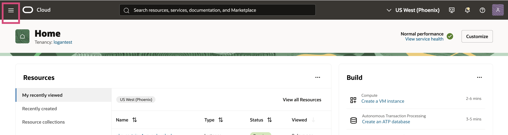 
 
 1.  Navigate to Observability & Management and click Log Explorer within Log Analytics. 
      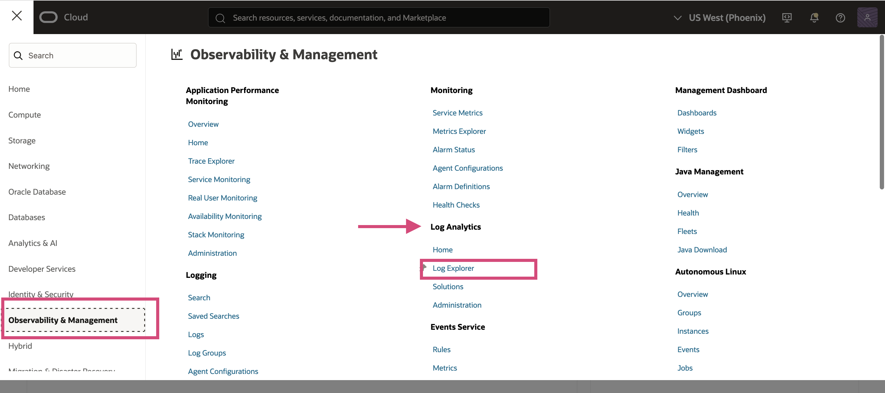

## Task 2: Learn different section of Log Explorer

 The different sections of Log Explorer are 
 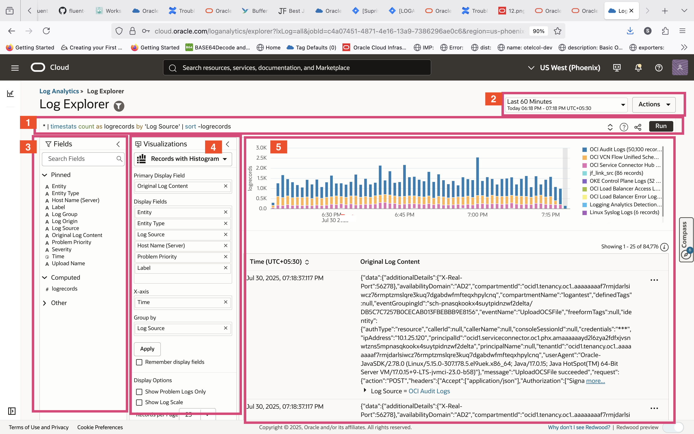
 1. Query bar, with Clear, Search Help, and Run buttons at the right end of the bar.
 2. Time range menu, and Actions menu where you can find actions such as, Open, Save, and Save as.
 3. Fields panel, where you can select sources and fields to filter your data.
 4. Visualization panel, where you can select the way to present search data in a form that helps you.
 5. Main panel, where the visualization outputs appear above the results of the query.

## Task 3: Understand key features of Log Explorer

1. Click on **Compass** icon  present on the  right hand side of the page. 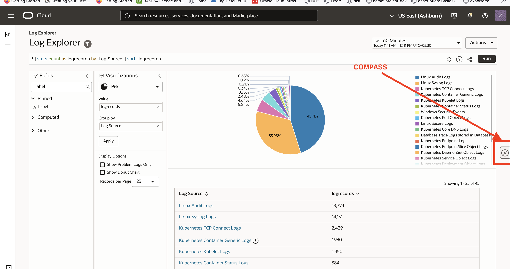  This will open the compass section that comprises of -
      - Add Data
      - Videos
      - Tips
      - What's New
      - Sample Log Data

   **Enable** the **Sample Log Data**  in order to populate the Log Explorer with predefined sample logs.
    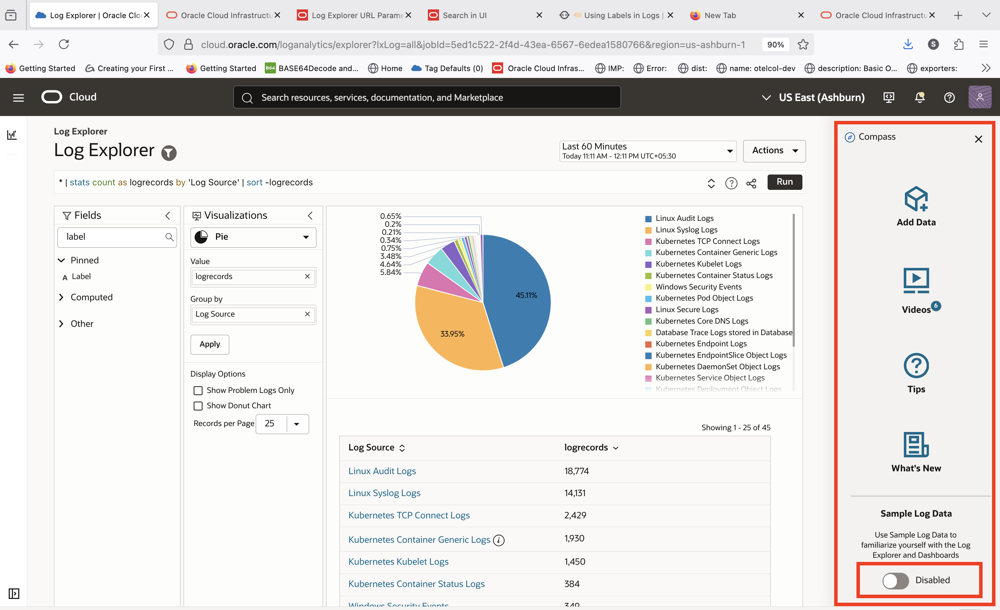

    After enabling log data close the **Compass Section**.

2. In **Main Panel**  the results of the query is displayed along with visualization.The interactive data visualizations in OCI Log Analytics enable you to get deeper insights into your log data. Depending on the data you want to filter, group, and compare, you can choose various visualization types, from a rich set of options within **Visualization Pannel**  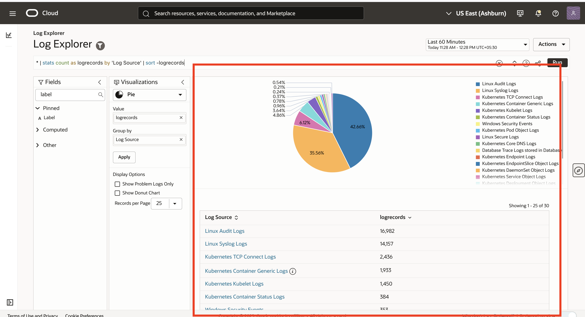

<em> Pie Chart </em> is one of the visulaization available in log explorer that shows the overall composition of a data set by encoding the percentage values in angles. It is a circular representation of the count of the log records that are grouped using the input parameter.
   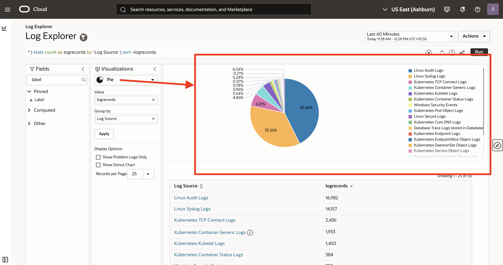

3. **Fields Panel**  - The Fields panel of Oracle Log Analytics lists the field attributes based on which you can filter log data. The fields are put into buckets Pinned, Computed, and Other based on your usage. 
    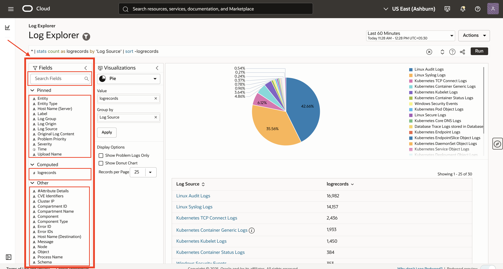

Set **Time range**  to **Last 14 Days**. 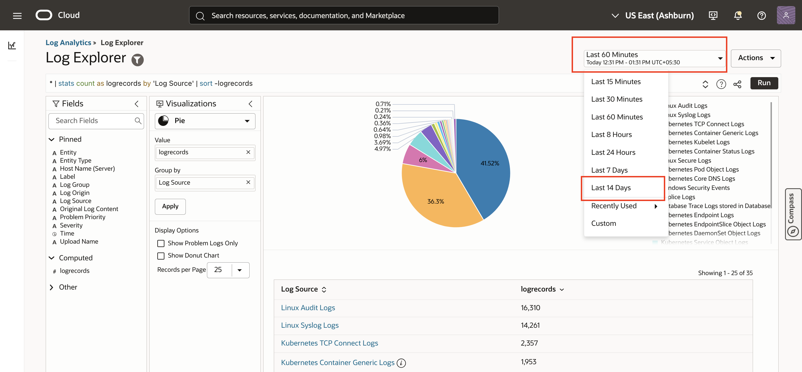

You can also perform field searches to filter logs based on specific fields. Search for **Label** in **Search Field**.  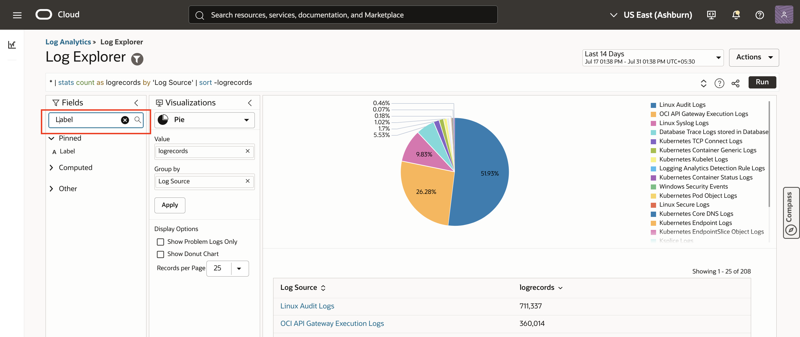

After that click on Label and Select <em>Log Writer Switch</em> and <em>Checkpoint Wait</em> and Apply. 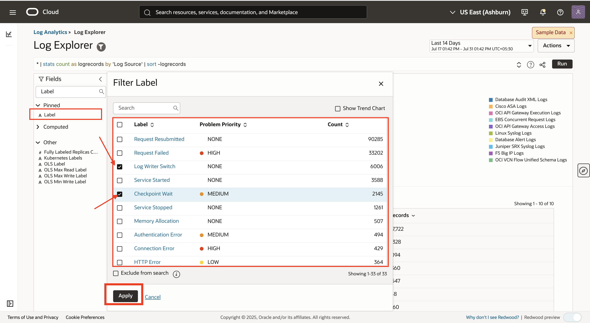

Accordingly the query within the query bar changes and label selected is added to it and hence log records and pie chart gets updated. 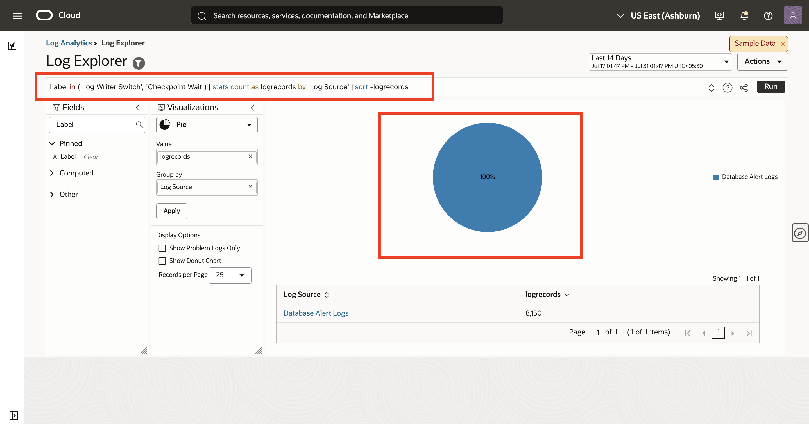

Within **Vizualization Panel** change visualization to <em>Records with Histogram</em> 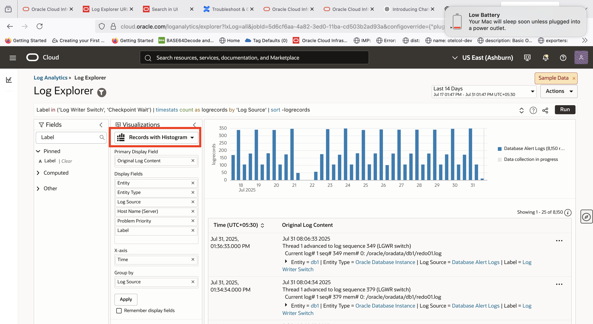

The visualization changes from pie Chart to Records with Histogram . Browse to second log entry and Click on Message Field and right click on it. One can see various menu option available there like 'Add to Search', 'Exclude from search', 'Enrich source' etc.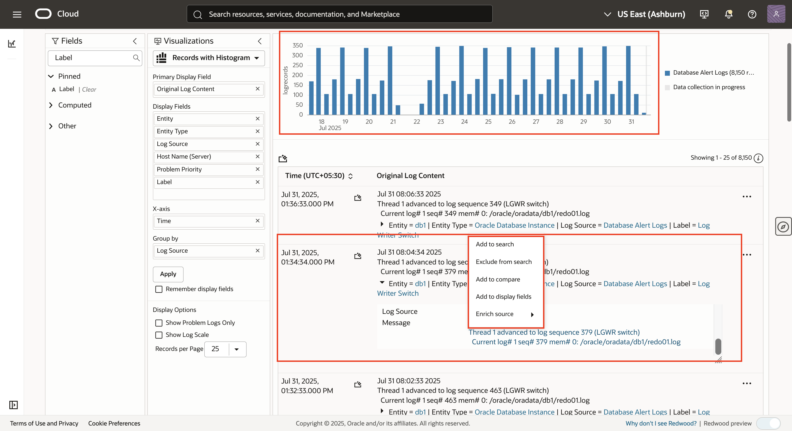

**Congratulations!** In this lab, you have successfuly completed the following tasks:
- Understanding Log Explorer

You may now proceed to the [next lab](#next).

## Acknowledgements
* **Author** - Supriya Joshi, OCI Log Analytics
* **Contributors** -  Supriya Joshi, Jolly Kundu, Kumar Varun, Royce Fu
* **Last Updated By/Date** - Supriya Joshi, Jul, 2025
